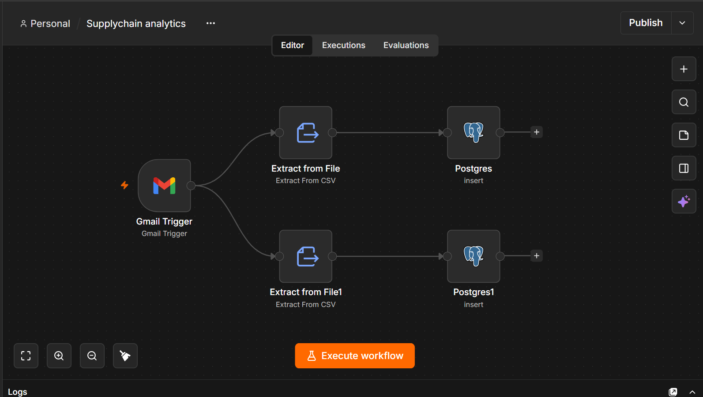
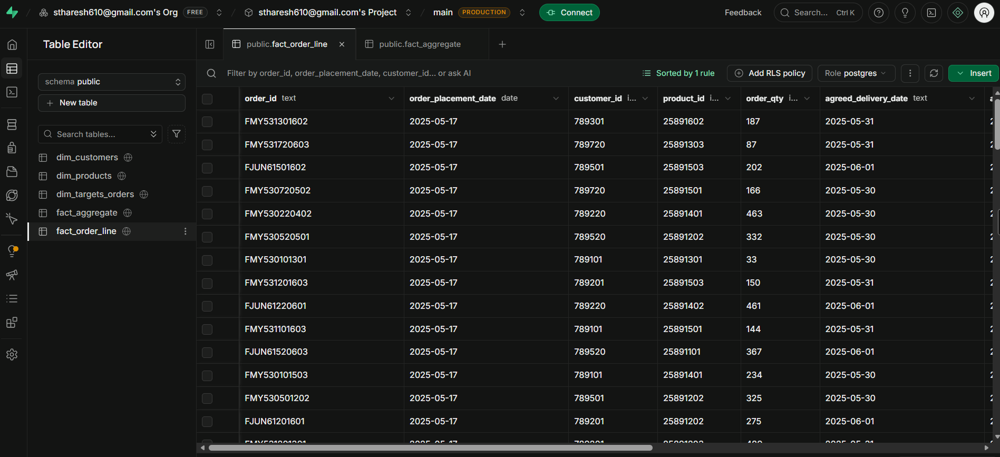
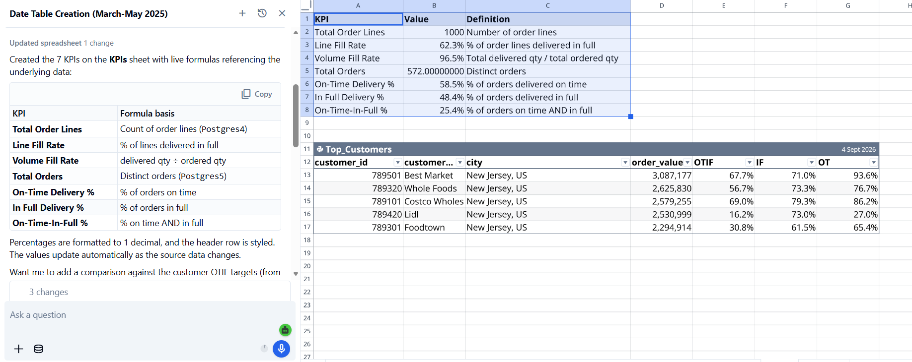

# Automated Supply Chain Analytics Pipeline

## Project Overview

This project demonstrates an automated end-to-end supply chain analytics workflow.

Daily regional sales and order-fulfillment files received through Gmail are automatically extracted as CSV files and inserted into PostgreSQL. The data is organized in Supabase using a fact-and-dimension data model.

The resulting dataset is connected to Quadratic AI, where natural-language prompts are used to calculate supply-chain KPIs and analyze customer fulfillment performance.

## Project Architecture

```text
Gmail
  |
  | Daily regional sales/order files
  v
Native Workflow Automation
  |
  | Extract CSV files
  v
PostgreSQL
  |
  | Insert records
  v
Supabase
  |
  +-----------------------------+
  |                             |
  v                             v
Dimension Tables              Fact Tables
  |                             |
  +-- dim_customers             +-- fact_order_line
  +-- dim_products              +-- fact_aggregate
  +-- dim_targets_orders
  |
  v
Quadratic AI
  |
  v
KPIs & Business Analysis
  |
  v
Supply Chain Insights
```

## Data Pipeline

### 1. Gmail Data Source

Daily regional sales and order-fulfillment files are received through Gmail.

The automation workflow is triggered when the relevant email arrives.

### 2. Automated CSV Extraction

The workflow extracts the incoming CSV files from the email.

Two workflow branches are used for the two data files:

- Order-line data
- Order-level fulfillment/aggregate data

### 3. PostgreSQL Data Ingestion

The extracted CSV data is passed to PostgreSQL using INSERT operations.

This automates the repetitive process of downloading files and manually loading them into the database.

### 4. Supabase

The PostgreSQL database is managed through Supabase.

The analytical model contains five main tables.

## Database Model

### Dimension Tables

#### `dim_customers`

Stores customer master information.

Key attributes:

- Customer ID
- Customer name
- City
- Currency

#### `dim_products`

Stores product master information.

Key attributes:

- Product ID
- Product name
- Category
- Price in INR
- Price in USD

#### `dim_targets_orders`

Stores customer-level fulfillment targets.

Key metrics:

- On-Time target
- In-Full target
- OTIF target

### Fact Tables

#### `fact_order_line`

Contains detailed order-line transaction data.

**Grain:** one record per order-product line.

Key fields include:

- Order ID
- Order placement date
- Customer ID
- Product ID
- Order quantity
- Agreed delivery date
- Actual delivery date
- Delivery quantity
- In-Full indicator
- On-Time indicator
- OTIF indicator

#### `fact_aggregate`

Contains order-level fulfillment performance.

**Grain:** one record per order.

Key fields include:

- Order ID
- Customer ID
- Order placement date
- On-Time indicator
- In-Full indicator
- OTIF indicator

## Supply Chain KPIs

The data was analyzed using Quadratic AI to calculate key supply-chain performance indicators.

| KPI | Definition |
|---|---|
| Total Order Lines | Number of order lines |
| Total Orders | Number of distinct orders |
| Line Fill Rate | Percentage of order lines delivered in full |
| Volume Fill Rate | Delivered quantity divided by ordered quantity |
| On-Time Delivery % | Percentage of orders delivered on time |
| In-Full Delivery % | Percentage of orders delivered in full |
| OTIF % | Percentage of orders delivered both on time and in full |

## Quadratic AI Analysis

Quadratic AI was used as the analytical layer after the database was populated.

Natural-language prompts were used to answer questions such as:

- What is the overall order fulfillment performance?
- What is the On-Time Delivery percentage?
- What is the In-Full Delivery percentage?
- What is the overall OTIF percentage?
- Which customers have the highest order value?
- Which customers have the lowest OTIF performance?
- Which customers are below their OTIF target?
- Which customers require attention based on fulfillment performance?
- What are the major supply-chain performance gaps?

## Example Analysis

The Quadratic analysis generated KPIs from the full analysis dataset, which is not the same as the reduced sample dataset committed to this repository. The sample files are provided to demonstrate the data structure and relationships; they do not reproduce the KPI totals below.

The analysis generated KPIs including:

- **Total Order Lines:** 1,000
- **Total Orders:** 572
- **Line Fill Rate:** 62.3%
- **Volume Fill Rate:** 96.5%
- **On-Time Delivery:** 58.5%
- **In-Full Delivery:** 48.4%
- **OTIF:** 25.4%

Customer-level analysis was also performed using:

- Order Value
- OTIF %
- In-Full %
- On-Time %

These metrics help identify customers with fulfillment-performance gaps.

## Business Value

The project automates a repetitive data-ingestion process in which daily regional files are received through email.

Instead of manually:

1. Opening the email
2. Downloading attachments
3. Processing the CSV files
4. Loading the data into a database
5. Preparing the data for analysis

the workflow automates the ingestion stage and makes the data available for downstream analysis.

This creates a simple pipeline from **operational data to business insights**.

## Technologies Used

- Gmail
- Workflow Automation
- CSV
- PostgreSQL
- Supabase
- SQL
- Quadratic AI
- GitHub

## Repository Structure

```text
automated-supply-chain-analytics/
|
+-- database/
|   +-- schema.sql
|   +-- analysis_queries.sql
|
+-- sample_data/
|   +-- README.md
|   +-- dim_customers_sample.csv
|   +-- dim_products_sample.csv
|   +-- dim_targets_orders_sample.csv
|   +-- fact_order_line_sample.csv
|   +-- fact_aggregate_sample.csv
|
+-- quadratic/
|   +-- business_questions.md
|
+-- screenshots/
|   +-- automation_workflow.png
|   +-- supabase_tables.png
|   +-- quadratic_analysis.png
|
+-- .gitignore
+-- README.md
```

## Screenshots

### Automation Workflow



### Supabase Database



### Quadratic AI Analysis



## Future Improvements

Potential enhancements include:

- Automated data validation
- Duplicate-record detection
- Error handling and workflow logging
- Automated KPI reporting
- Power BI dashboard integration
- Regional performance dashboards
- Automated customer target comparison
- Alerts for low OTIF performance

## Skills Demonstrated

- Data pipeline automation
- Email-based data ingestion
- CSV processing
- PostgreSQL
- Supabase
- SQL
- Fact and dimension modeling
- Supply-chain analytics
- KPI development
- Customer performance analysis
- AI-assisted analytics
- Business question formulation
